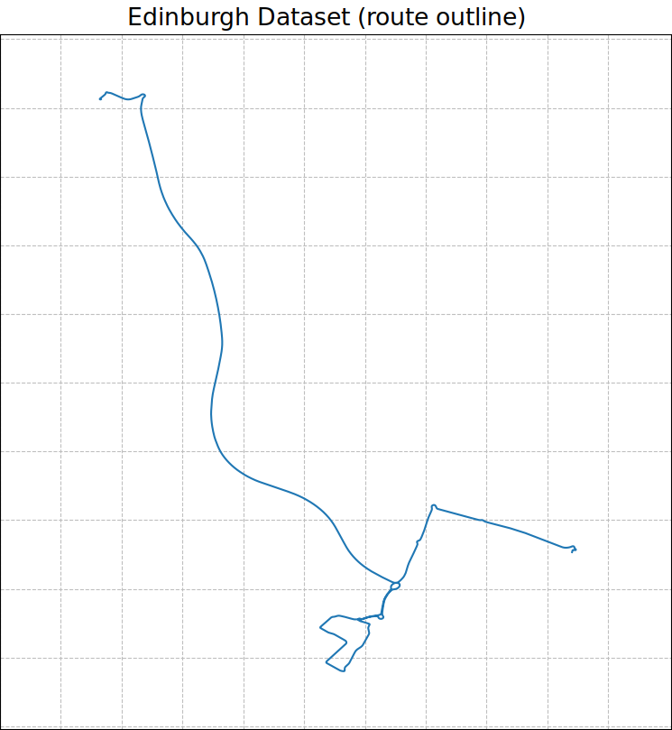

# Edinburgh VPR Dataset

This page presents the Edinburgh visual place recognition and scene classification dataset presented in the paper 'OpenSceneVLAD: Appearance Invariant, Open Set Scene Classification' published in ICRA 2022. Please cite our paper if you use this dataset. 

## Getting Started

This dataset contains three traversals of one 19.5km route around Edinburgh, the Scottish capital city in urban, rural and motorway environments: 20210524 (overcast), 20210526 (evening) and 20210804 (sunny) using a dash-mounted OnePlus 7T recording 4k video at 30fps and a GPS logger app. We have also hand annoted the datasets to identify four classes within them and all remaining images are labelled as open set images:

Class number       | Class label
------------- | -------------
1  | Pedestrain Crossing
2  | Roundabout
3  | Bus Stop
4  | Bridge
5  | Open Set

Please note: all hand annotations of classes were done were done as reasonably as possible given the challenging and dynamic conditions of the environment.

### Format

Our dataset is made up of three folders corresponding to each traversal and within each folder is  

### Download

We are Currently working on 

## Authors

  * **William H.B. Smith** - *Initial work* - [WHBSmith](https://github.com/WHBSmith)

## License

This project is licensed under the MIT License - see the [LICENSE.md](LICENSE.md) file for details

