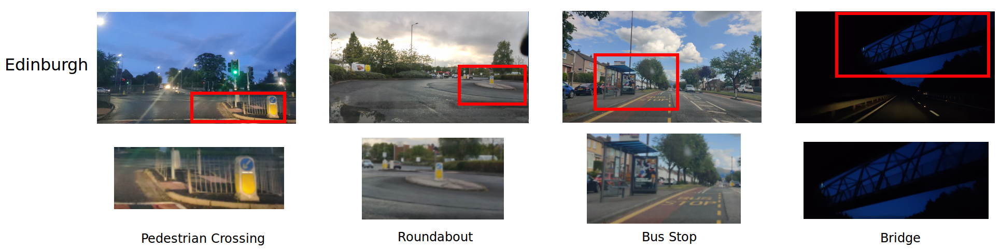

# Edinburgh VPR Dataset

This page presents the Edinburgh visual place recognition and scene classification dataset presented in the paper 'OpenSceneVLAD: Appearance Invariant, Open Set Scene Classification' published in ICRA 2022. Please cite our paper if you use this dataset. 

## Getting Started

This dataset contains three traversals of one 19.5km route around Edinburgh, the Scottish capital city in urban, rural and motorway environments: 20210524 (overcast), 20210526 (evening) and 20210804 (sunny) using a dash-mounted OnePlus 7T recording 4k video at 30fps and a GPS logger app. This dataset is designed for visually invariant place recognition but we have also hand annoted the datasets to identify four classes within them and all remaining images are labelled as open set images:

Class number       | Class label | Average frame count
------------- | -------------  | -------------
1  | Pedestrain Crossing | 53 
2  | Roundabout | 135
3  | Bus Stop | 46
4  | Bridge | 47
5  | Open Set | 843
|| total: 1124

Please note: all hand annotations of classes were done were done as reasonably as possible given the challenging and dynamic conditions of the environment.

### Class sample images

### Format

Our dataset is made up of three folders corresponding to each traversal and within each folder is  

### Download

We are currently working on finding as file sharing solution for hosting this large dataset (10GB+) 

## Authors

  * **William H.B. Smith** - *Initial work* - [WHBSmith](https://github.com/WHBSmith)

## License

This project is licensed under the MIT License - see the [LICENSE.md](LICENSE.md) file for details

